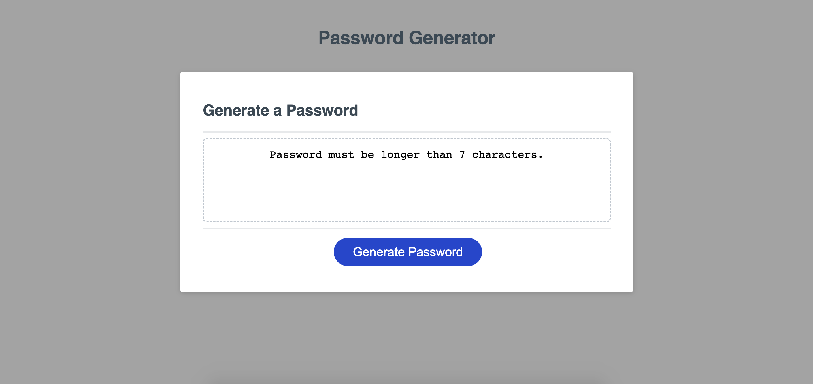

# JavaScript Password Generator

This project is a simple password generator using 2 pre-assigned variables - Length and Character Usage.

This was my first experience of building a JavaScript application from scratch and so it was interesting to see the various different methods of achieving a similar end result.

The design is very simple as to not clutter the page, and just focuses on the central password generator element.

The deployed code is accessible here: https://github.com/dylanadams98/password-generator-project

The deployed page is accessible here: https://dylanadams98.github.io/password-generator-project

